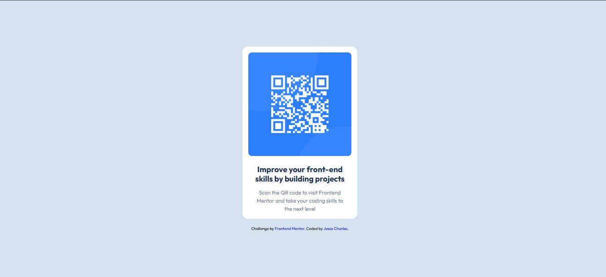

# Frontend Mentor - QR code component solution

This is a solution to the [QR code component challenge on Frontend Mentor](https://www.frontendmentor.io/challenges/qr-code-component-iux_sIO_H). Frontend Mentor challenges help you improve your coding skills by building realistic projects. 

## Table of contents

- [Overview](#overview)
  - [Screenshot](#screenshot)
  - [Links](#links)
- [My process](#my-process)
  - [Built with](#built-with)
  - [What I learned](#what-i-learned)
  - [Continued development](#continued-development)
  - [Useful resources](#useful-resources)
- [Author](#author)
- [Acknowledgments](#acknowledgments)

## Overview

### Screenshot



This is a screenshot of the QR code component solution.

### Links

- Solution URL: [GitHub Repository](https://github.com/jessecharles123/qr-code-component)
- Live Site URL: [GitHub Pages](https://jessecharles123.github.io/qr-code-component/)

## My process

### Built with

- Semantic HTML5 markup
- CSS custom properties
- Flexbox
- Mobile-first workflow

### What I learned

In this project, I practiced responsive design using CSS media queries for mobile and desktop layouts. I also utilized CSS custom properties (variables) for consistent theming and improved maintainability.

```css
:root {
  --bgcolor: hsl(212, 45%, 89%);
  --hdcolor: hsl(218, 44%, 22%);
}
```

This approach made it easier to manage colors across the stylesheet.

### Continued development

I want to continue improving my skills in CSS Grid and JavaScript for more interactive components. Additionally, learning about accessibility best practices to ensure all users can enjoy the web.

### Useful resources

- [Frontend Mentor](https://www.frontendmentor.io) - Great platform for practicing front-end skills with real-world projects.
- [Google Fonts - Outfit](https://fonts.google.com/specimen/Outfit) - The font used in this project for a clean, modern look.
- [MDN Web Docs](https://developer.mozilla.org/en-US/docs/Web/CSS) - Excellent resource for CSS properties and best practices.

## Author

- Frontend Mentor - [@jessecharles123](https://www.frontendmentor.io/profile/jessecharles123)
- GitHub - [jessecharles123](https://github.com/jessecharles123)

## Acknowledgments

Thanks to Frontend Mentor for providing this challenge and helping developers improve their skills through practical projects.
